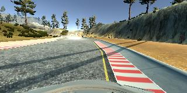

# Behavioral Cloning

This project explores an approach to autonomous driving where a neural network
is trained based on driving behavior patterns. This method uses frames of a video
of a vehicle being driven on a simulator track to train a CNN model. The model therefore
learns based on the driving behavior recorded as the vehicle is operated during simulation.
The simulator includes two tracks - easy and difficult; I'll focus on the first track (easy) for
this project. This track is a flat, single lane road on the countryside
with natural terrain features including rock formations, hillsides with trees
and bodies of water with a bridge (sample images included below). The simulator is capable of producing training
data where each frame includes the steering wheel angle that will be used to train
a neural network. The trained model will then predict the steering angle of a
simulation frame-by-frame in autonomous mode. While in
autonomous mode, the acceleration seems to be preset to maintain constant speed
of 9 MPH.

## Goals

* Use the provided simulator to collect training data.
* Build a convolution neural network in Keras to predict steering angles.
* Train and validate the model with a training and validation set
* Test the model with the simulator in autonomous mode.
* Iterate data collection, model tweaking, hyper-parameter tuning and testing until the model can steer the vehicle successfully around the track.
* Summarize the results.

## Rubric Points

Here I will consider the [rubric points](https://review.udacity.com/#!/rubrics/432/view) individually and describe how I addressed each point in my implementation.  

### Required Files

* model.py - creates and trains the model
* drive.py - accepts frames from the simulator and predicts steering angles, driving the vehicle in autonomous mode
* model.h5 - final model with trained parameters capable of driving the simulator around the easy track
* video.mp4 - recording of a successful loop around the first track in autonomous mode
* writeup_report.md - (linked to this file) summarizing the results

### Code Functionality & Quality

Use model.py to create and train the model with training data recorded from the simulator in training mode.
Within a directory used to record a simulator session, this script will read driving_log.csv and the IMG directory
and save the trained model as model.h5.
```sh
cd <simulator_recording_dir>
python .../model.py
```

Use drive.py with model.h5 as follows with the simulator in autonomous mode (first track) to drive the vehicle around the track:
```sh
python drive.py model.h5
```

The model.py script includes documentation of the model architecture along with loading and normalizing the training data - the code is
organized and readable.

### Model Architecture and Training Strategy

* Appropriate model architecture

The final model used to successfully drive the vehicle around the first track is based on a
[CNN published by a research group at NVIDIA](https://images.nvidia.com/content/tegra/automotive/images/2016/solutions/pdf/end-to-end-dl-using-px.pdf)
as suggested in the course lecture. It includes normalization layers and convolutional layers with relu activations.

* Model tuning

Dropout layers are used between the fully-connected layers to reduce overfitting. Training and validation splits were
used to tune the model and iterate with the built-in Keras Adam optimizer.

* Appropriate training data

Training data was collected to influence the correct driving behavior as appropriate based on feedback from autonomous driving testing.

#### Model details

After normalization of features, the model uses 5 convolutional layers followed by 3 fully-connected layers.
Refer to the [NVIDIA publication](https://images.nvidia.com/content/tegra/automotive/images/2016/solutions/pdf/end-to-end-dl-using-px.pdf) (p5)
and model.py (lines 85-109) documentation for details and dimensions of each layer. Each convolutional layer includes pooling,
and dropouts were added between each fully-connected layer.
A single, continuous numerical output between -1 and 1 is used to predict the steering angle as-is.

During training, recorded sessions were saved as a series individual jpeg image files (frames). These files are streamed as input
during training via a python generator (model.py line 34), which shuffle the images to randomize input. Preprocessing of image data includes:

* converting to grayscale (described further below)
* crop the top 60 pixels to focus the learning on the road area
* crop the bottom 20 pixels, which show the front of the car and are mostly constant
* resize (scale) the image to 66x200

#### Training Strategy

With the model defined, the next step was to train it and iterate on tuning, tweaking and testing.

The model had a tendency to over-fit the training data with lower accuracy on test data from the simulator, so
three dropout layers were introduced between the fully-connected layers.

Initial training data was exclusively from very accurate driving behavior, driving in the center of the lane with smooth
turns in an attempt to teach the network to consistently stay on the track. This strategy turned out to be insufficient as the car
soon drove off the track during testing. The model needed to generalize better for cases where the car would eventually
veer to one side or the other. No matter how good the driving behavior during training, the model will never
predict steering angles with perfect accuracy, so it needs to know what to do in those situations. Ideally, there would be a frame with the
car in any position within the lane. Also,
as suggested in the guidelines, there seemed to be a bias to steer to the left since the car was to go counter-clockwise
around the track. To address these two issues, I included a few laps of driving the opposite direction (clockwise) around
the track along with recordings of "recovering" starting from either side of the track in several locations in both directions
of the track.

After a few more iterations with some improvement, I sought to get more training data for even better generalization.
Instead of getting more of the same accurate driving (middle of the road), I taught my 7-yr son to drive around the track and
recorded several more laps of his driving, which was more erratic but always recovered and managed to stay on the road.
This improved testing in autonomous mode significantly, and left only a couple of trouble spots including a tendency to
drive onto the dirt pathway. To address the remaining issues, I tried including several recordings of accurate driving in
just those areas and varied the cropped dimensions to no avail. Lastly, I tried converting training image data to grayscale,
which finally worked getting through the final trouble areas.

In summary, the training and testing process was iterative and highly empirical. With some guidelines from the course material
giving me a base model to start with and suggestions about what kind of training data and behaviors work best, I found the
following points to be important:

* use dropout layers between fully-connected layers
* include a wide variety of training data, not just accurate, middle-of-the-road driving, but even sloppy driving as long as the vehicle
stays on the track is useful
* only 1 or 2 epochs are necessary, otherwise testing can give even worse results, perhaps from overfitting
* grayscale seems to give the best results during testing in autonomous mode, at least for this track/simulation

Final hyper-parameter values (model.py lines 26-32):

| Parameter | Value             |
|:----|---------------------:|
| epochs | 1
| dropout (ignore rate) | 0.25
| crop top of image (pixels) | 60
| crop bottom of image (pixels) | 20
| training/validation set split | 98/2
| batch size | 32


25,539 images were used in training/validation with a total number of 25,539 x 66 x 200 = 337,114,800 data points.


### Training Data Samples

Center lane driving (full and cropped/grayscale as used in training):


")

Example recovery starting from the left edge of the road:





